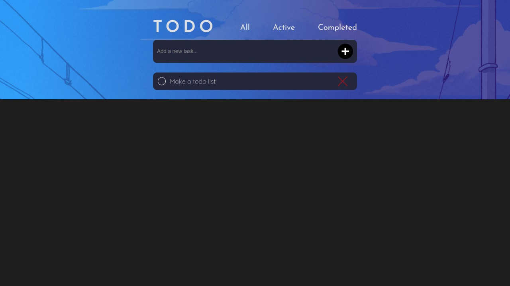

# To do app

## Table of contents

- [Overview](#overview)
  - [The challenge](#the-challenge)
  - [Screenshot](#screenshot)
  - [Built with](#built-with)
  - [Installation](#installation)
  - [Links](#links)
- [Author](#author)

## Overview

It is a simple to do list application made with nodejs to record your daily tasks.

### The challenge

Users should be able to:
- Add new todos to the list
- Mark todos as complete
- Delete todos from the list
- Filter by all/active/complete todos

## Screenshot

## Build With

- [NodeJS](https://nodejs.org/en/) - JS runtime environment
- [Express](http://expressjs.com/) - The web framework used
- [Mongoose](https://mongoosejs.com/) - Object Data Modelling (ODM) library
- [MongoDB Atlas](https://www.mongodb.com/cloud/atlas) - Cloud database service
- [Pug](https://pugjs.org/api/getting-started.html) - High performance template engine

## Installation

You can fork the app or you can git-clone the app into your local machine. Once done that, please install all the dependencies by running
'''
$ npm i
set your env variables
$ npm start
'''

## Links

- [ToDo](https://aryan-to-do-app.herokuapp.com)

## Author

Aryan Agarwal
From Frontend Mentor
